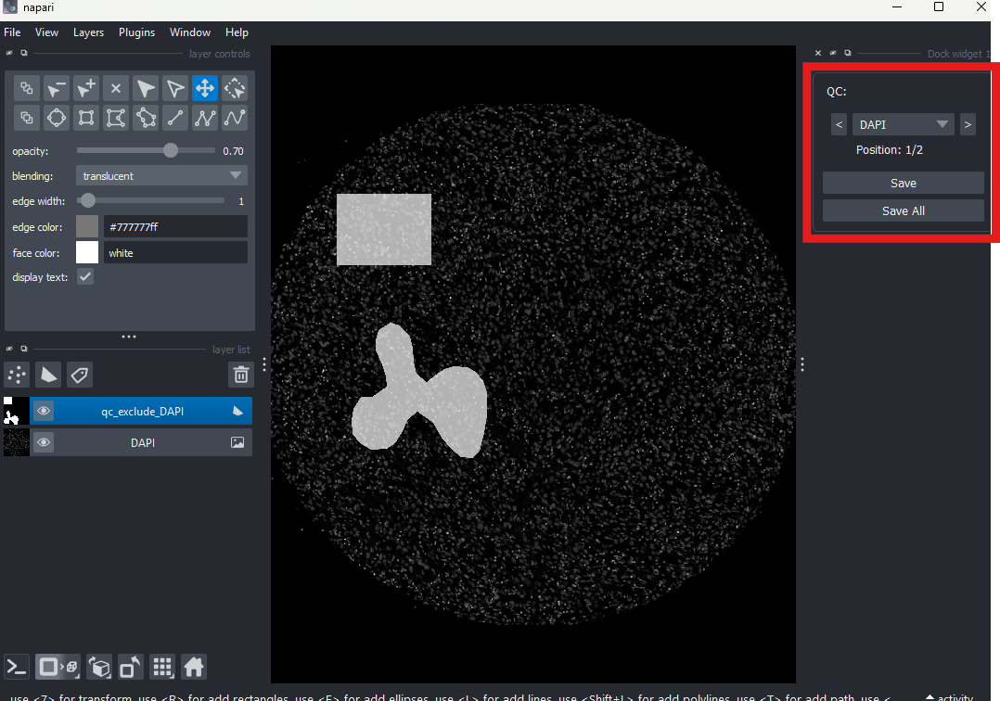

# Quality Control (QC)

## Overview

This is a manual step performed by user drawing exclusion shapes.
To support it we provide a napari widget that can be easily operated from a Jupyter [notebook](https://github.com/StallaertLab/plex-pipe/blob/main/notebooks/03_QC_demo.ipynb).

*   **Input:** SpatialData objects containing marker images.
*   **Output:** User-defined exclusion shapes for each marker (added to SpatialData objects).

Specified polygons will be used in the quantification step to create masks in the AnnData tables marking if an intensity-based properties for a given channel/marker should be included in the downstream analysis.

Parameters of this step are defined in the Quality Control (QC) part of [configuration](../configuration/reference.md#quality-control).

---
## Notebook Workflow

Execute the following sections within the [Quality Control notebook](https://github.com/StallaertLab/plex-pipe/blob/main/notebooks/03_QC_demo.ipynb) sequentially:

* **Read in config**: Specify the absolute pathway to the analysis configuration file to initialize the session settings.
* **Select SpatialData Object**: This section generates a list of available SpatialData objects. Adjust the `ind` parameter to select the specific ROI for review.
* **Initialize Napari QC Widget**: Launches an interactive Napari viewer equipped with a custom widget designed for rapid data annotation:
    * **Marker Navigation**: Facilitates efficient browsing of markers within the SpatialData object via forward/backward navigation arrows or by selecting a specific marker from the dropdown menu.
    * **Interactive Annotation**: A dedicated shapes layer is automatically generated for each marker. Use [Napari's native shape tools](https://napari.org/dev/howtos/layers/shapes.html) to delineate regions for exclusion.
    * **Automated Persistence**: If a marker already contains existing exclusion geometries, they are automatically loaded into the viewer for further editing.
    * **Data Export**: Utilize the `Save` and `Save All` buttons to commit exclusion polygons for the active marker or the entire ROI, respectively.
    * **Session Termination**: Close the Napari viewer interface once the annotations are completed and saved.
* **Iterative Review**: Return to the **Select SpatialData Object** section, update the object index, and repeat the annotation process for all remaining ROIs.

---
## Alternative Execution Workflows

Since Step 2 ([ROI Extraction](02_roi_cutting.md)), Step 4 ([Image Processing](04_image_processing.md)), and Step 5 ([Quantification](05_quantification.md)) are fully automated and require no manual intervention, they may be executed sequentially. In this configuration, the Quality Control (QC) stage can be deferred until after the quantification is complete. This is possible because the QC process appends exclusion masks directly to the `AnnData` tables, and these geometries are not a prerequisite for the quantification itself.

To implement quality control after the quantification phase, please refer to the [post-quantification QC notebook](https://github.com/StallaertLab/plex-pipe/blob/main/notebooks/extras/06_add_QC_after_quantification.ipynb).
